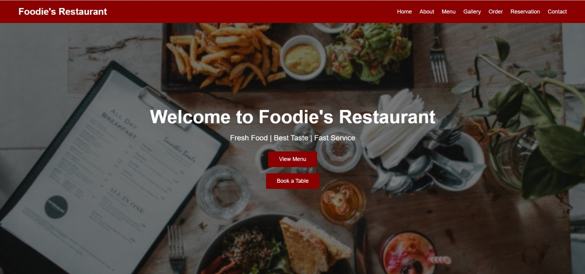
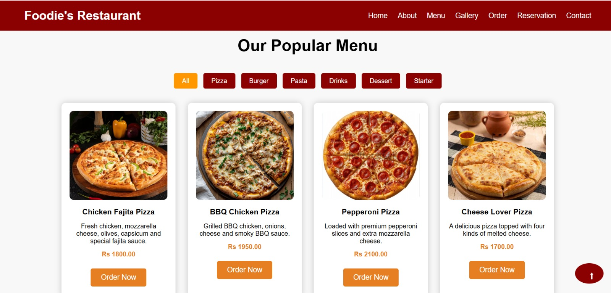
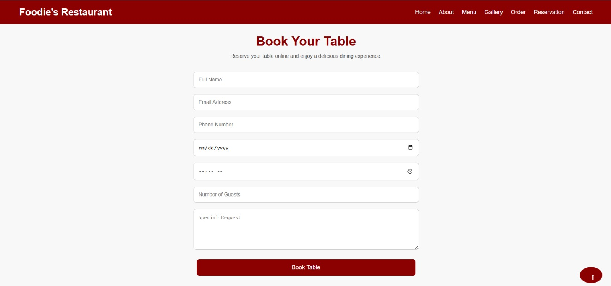
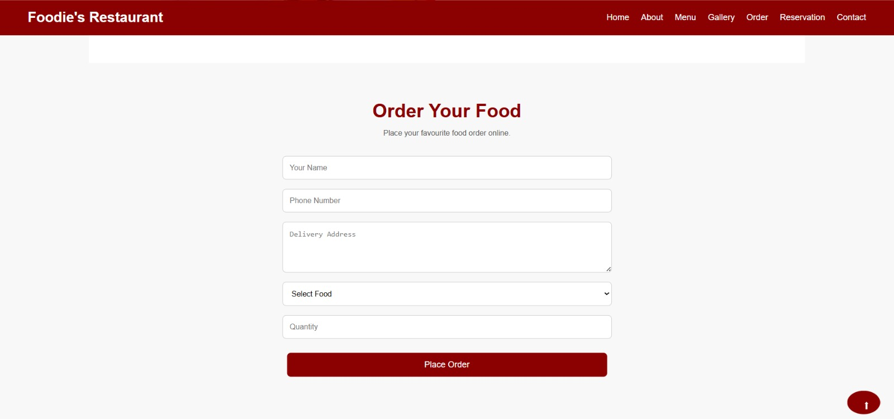
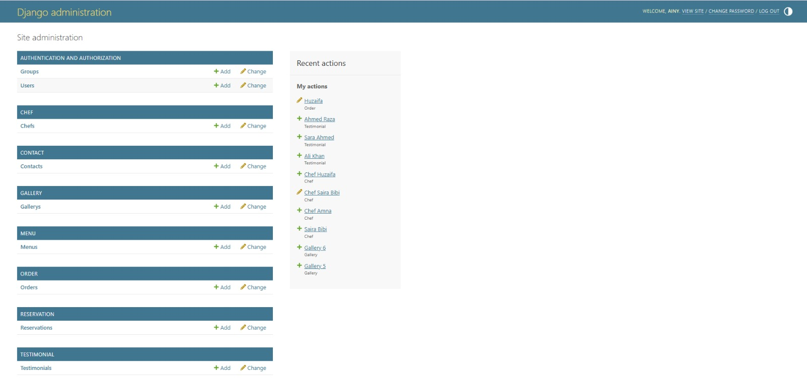

# 🍽️ Restaurant Management System

A full-stack Restaurant Management System developed using Django. The project allows customers to browse the menu, place food orders, reserve tables, and send contact messages. An admin dashboard is provided to manage restaurant data efficiently.

## 📌 Features

- Responsive Restaurant Website
- Online Food Ordering
- Table Reservation System
- Contact Form
- Dynamic Menu Management
- Gallery Section
- Chef Section
- Testimonials
- Django Admin Dashboard
- SQLite Database

## 🛠️ Technologies Used

- Python
- Django
- HTML5
- CSS3
- JavaScript
- SQLite

## 📂 Project Structure

```
Restaurant Management System
│── home
│── menu
│── order
│── reservation
│── contact
│── gallery
│── chef
│── testimonial
│── restaurant
│── manage.py
│── requirements.txt
```

## 🚀 Installation

1. Clone the repository

```bash
git clone https://github.com/Qurat-ul-ain005/foodies-restaurant-website.git
```

2. Open the project folder

```bash
cd foodies-restaurant-website
```

3. Install dependencies

```bash
pip install -r requirements.txt
```

4. Run migrations

```bash
python manage.py migrate
```

5. Start the server

```bash
python manage.py runserver
```

6. Open your browser

```
http://127.0.0.1:8000/
```

## 📸 Screenshots

### Home Page



### Menu



### Reservation



### Order Form



### Admin Dashboard



## 👩‍💻 Author

**Qurat-ul-Ain**

BS Artificial Intelligence Student
